# Security Onion Lab: Passive PCAP Analysis


## Table of Contents
- [Objective](#simulation-objective)
- [Environment Overview](#environment-overview)
- [Network Configuration](#network-configuration)
- [Installation](#installation)
- [Custom Rule Creation](#step-8-creating-a-custom-suricata-rule)

##  Simulation Objective

Perform passive analysis of captured network traffic to:
1. Generate IDS/IPS alerts using Suricata rules
2. Extract network metadata and logs via Zeek
3. Observe how Security Onion ingests, correlates, and displays security events
4. Practice threat triage and incident response workflows
---

## Environment Overview

| Component | Specification |
|-----------|---------------|
| **Host OS** | Linux |
| **Virtualization** | VMware Workstation Pro/Player |
| **Security Onion** | Version 2.4 |
| **Installation Mode** | Evaluation Node (Standalone) |
| **Management Interface** | ens160 (NAT) |
| **Monitoring Interface** | ens161 (Host-only) |

---

## Network Configuration

| Interface | Type | IP Address | Purpose |
|-----------|------|------------|---------|
| **NIC 1 (ens160)** | NAT | 192.168.28.101 | Management (SSH, Web UI, Updates) |
| **NIC 2 (ens161)** | Host-only | N/A | Passive traffic monitoring |

**Network Settings:**
- Gateway: `192.168.28.2`
- DNS: `8.8.8.8`, `8.8.4.4`
- Subnet: `192.168.28.0/24`

---

## Installation

### 1. ISO Download

The ISO was obtained from the official [GitHub installation page](https://github.com/Security-Onion-Solutions/securityonion/blob/2.4/main/DOWNLOAD_AND_VERIFY_ISO.md).

After downloading, it is strongly advised to verify the checksum to confirm the ISO has not been tampered with or corrupted. 

It is important to note that hash comparisons are case-insensitive; thus, capitalization differences are irrelevant.

---

### 2. Setup

For this small-scale project, VMware Workstation Pro was selected as the virtualization platform. The **Evaluation Node** type was chosen due to its lower resource requirements.

Below is a hardware comparison chart from the documentation:

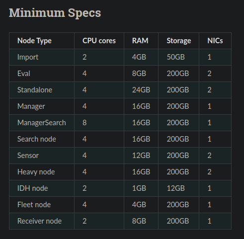

The full installation process is covered in the official [installation guide](https://docs.securityonion.net/en/2.4/first-time-users.html), so this document will focus only on configuration details relevant to this setup and test.

The following interfaces were configured:

- A **Management NIC** for SSH access, system updates, and accessing the web interface (Kibana).
- A **Monitoring NIC** dedicated to passive network traffic capture for tools like Suricata and Zeek.

NICs were added via VMware Workstation:

- The **NAT interface** was assigned for management.
- The **Host-only interface** was configured for monitoring.

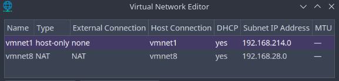

> Screenshot showing the virtual NIC configuration

Following setup, the system booted successfully and the web interface became accessible on interface `ens160`:

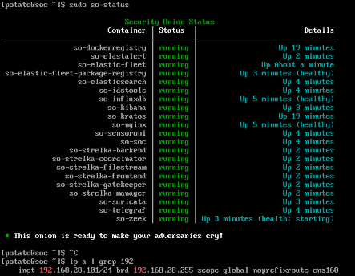

# Passive Analysis of a PCAP File

In this demonstration, we utilize a public malware analysis exercise from [Malware-Traffic-Analysis.net](https://www.malware-traffic-analysis.net/2022/01/07/index.html), which is widely used for training and investigation exercises.

---

### Step 1: SSH into Security Onion

First, establish an SSH connection to the Security Onion system using its hostname or IP address:

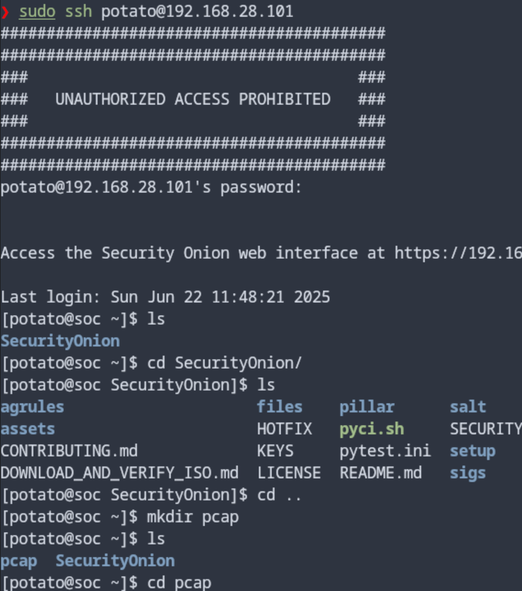

> Screenshot from local setup.

---

### Step 2: Download and Prepare the PCAP File

The exercise files are usually provided as ZIP archives. Use `wget` to download the exercise from the target URL:

```bash
wget <exercise>.zip
```

Unzip the file using:

```bash
unzip <exercise>.zip
```

---

### Step 3: Import the PCAP into Security Onion

Once extracted, import the `.pcap` file into Security Onion using the following command:

```bash
sudo so-import-pcap <exercise>.pcap
```

This command initiates analysis and ingestion of the PCAP file using Security Onion’s full stack (Zeek, Suricata, etc.).

---

### Step 4: Access the Dashboard

After import, a link is generated that leads to the Security Onion SOC dashboard. This dashboard provides access to all logs, alerts, and visualizations related to the captured traffic:

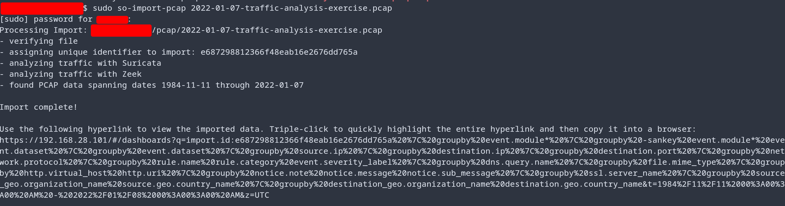

> Screenshot from local setup.

---

### Step 5: Triage and Analyze Critical Alerts

Here we are triaging a new excercise called "CatBomber".

The first step can be executed by first accessing the Security Onion dashboard to get a rough idea of the situation. The great thing about SO is how it gives you the big picture right away by breaking down the packet capture data using all its built-in tools like Zeek and Suricata.

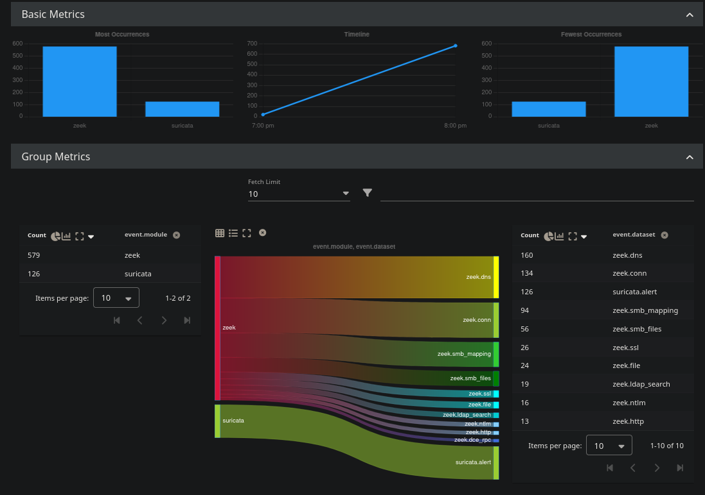


Events can be sorted by severity, which lets an analyst immediately spot and focus on the high-priority alerts. What’s most valuable is that Security Onion can identify the specific malware, in this case, **Trickbot**. It does this automatically by matching the network traffic against known signatures and behavioral rules. This identification is very useful for the analyst as it provides the right context for where to begin investigating.

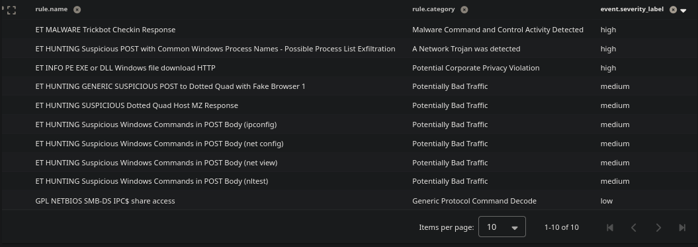

Using multiple online public sources like Google or Virustotal, we could learn more about this malware, its detections, and what the community has to say about it. Of course we could also analyze it further using the **Hunt** function in SO which shows interesting findings like geo location.

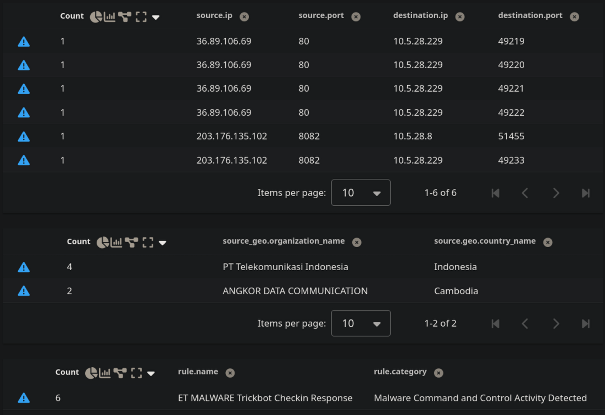

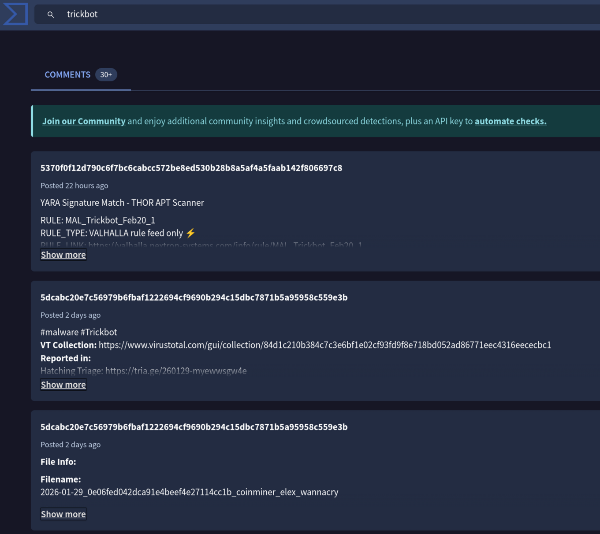

> Virustotal analysis

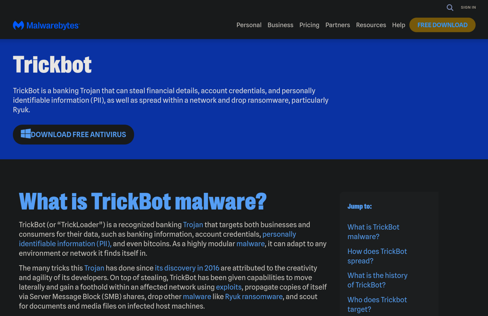

> Here we get an overview of the TrickBot malware given by MalwareBytes.

---

### Step 6: Reconstruct Network Activity with Zeek Logs

In this step, an analyst can dive into **Kibana** and filter for Zeek connection logs. The view can be cleaned up by removing extra dashboard widgets, that’s the beauty of Kibana being so customizable and tightly integrated with SO. By doing this, an analyst can piece together exactly what happened during the attack: who talked to whom, and when. It essentially provides a step-by-step replay of the network activity.

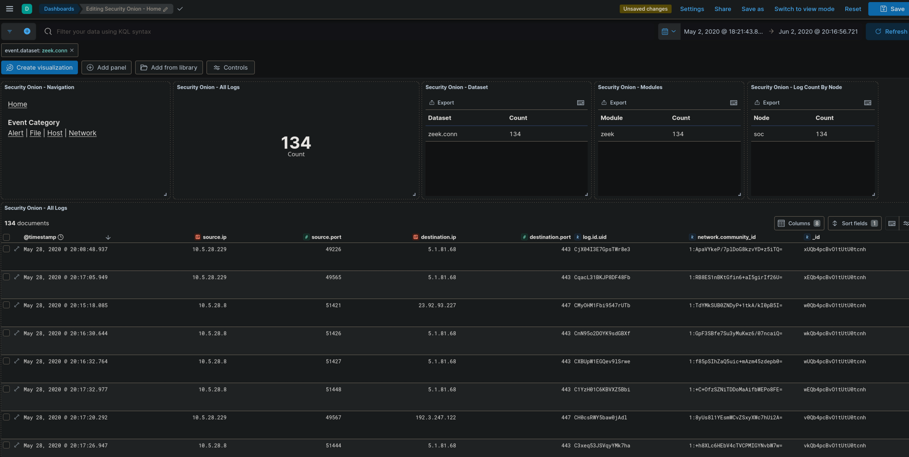

---

### Step 7: Collaborative work on the analysis using SO 

Analysts can move into Security Onion's **Cases** section. This feature acts as a shared investigative workspace. A new case for the incident can be opened, allowing the team to centralize all findings, upload relevant evidence like packet captures, and document potential Indicators of Compromise (IOCs). The case can also be used to discuss further updates or interesting findings discovered during the investigation.

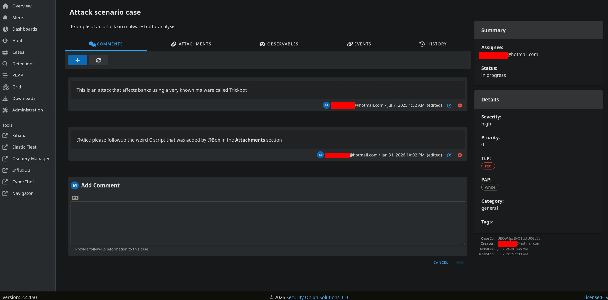

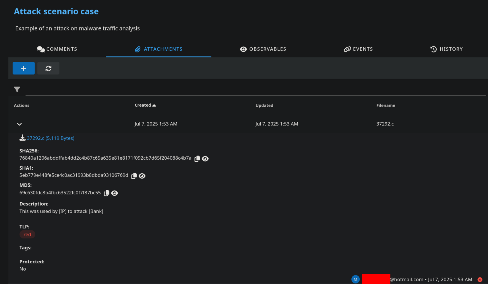

---

### Step 8: Creating a custom Suricata rule

#### **1- Identify the IOC for the Rule**
Based on the SO hunt alerts and Zeek logs, the key attacker (C2 server) IP is '36.89.106.69'. The victim on the internal network is '10.5.28.229'. The rule will alert on any traffic to the known malicious C2 IP.

#### **2- Creating the custom rule**
Going back to the original trickbot malware rule detection I wanted to do a custom rule that detects that this exact IP is part of an excercise by malware-traffic-analysis.net, so by duplicating and editing the original alert we can easily achieve this by editing the Detection source as shown below:


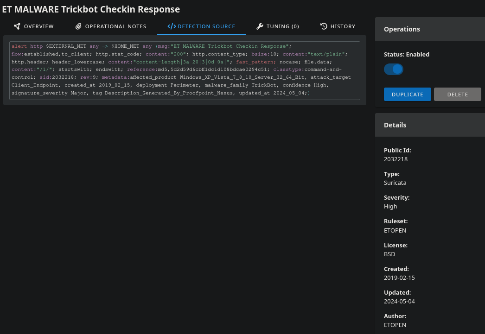
> Original Detection


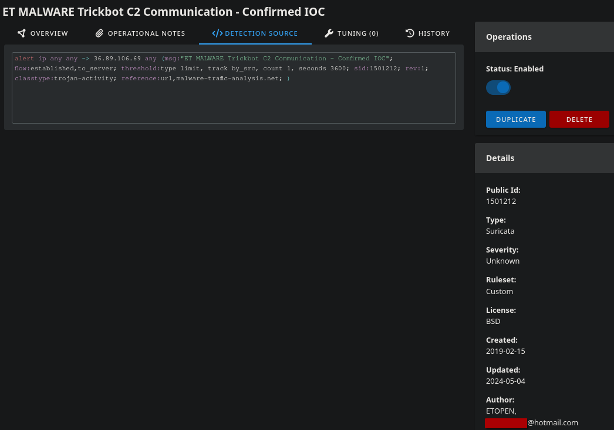
> Edited Detection

#### **3- Verifying**

We could easily verify by going back to our SO terminal and running the command `sudo so-test`

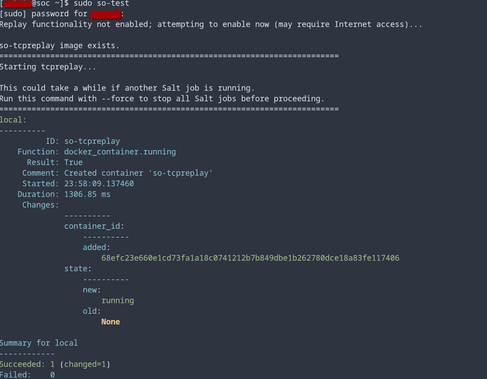

and then testing out the **Detections** back in SO

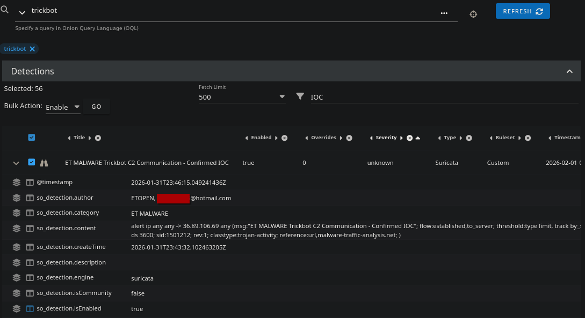
>Here we can see that it is enabled and detected as a custom ruleset created by me.

---

## References

- [Security Onion Documentation](https://docs.securityonion.net/en/2.4/)
- [Malware-Traffic-Analysis.net](https://www.malware-traffic-analysis.net/)
- [Suricata Rules Documentation](https://docs.suricata.io/en/latest/rules/intro.html)
- [Zeek Documentation](https://docs.zeek.org/en/stable/)
- [Security Onion GitHub - ISO Download and Verification](https://github.com/Security-Onion-Solutions/securityonion/blob/2.4/main/DOWNLOAD_AND_VERIFY_ISO.md)
- [Elasticsearch Reference](https://www.elastic.co/guide/en/elasticsearch/reference/current/index.html)
- [Kibana User Guide](https://www.elastic.co/guide/en/kibana/current/index.html)
